# Provider Account

Provider Account

<figure>
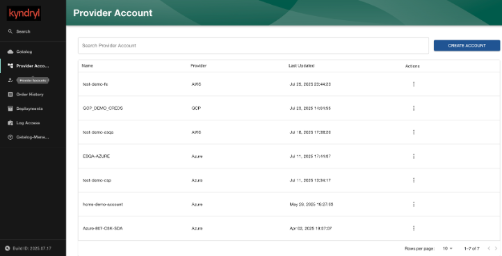

The above screen is the Provider Account screen which gets loaded
when the user clicks on the menu “Provider Account” on the left side
panel.

This screen is used to onboard the provider accounts that he/she
would like to be used for provisioning through the HCSM system. This
screen access is assigned to the users based on the RBAC design. It is
visible only for the users who have the access as per the RBAC.

Initially this screen displays all the providers accounts in the
system as shown in the screen above. The user has option to search for a
specific Provider account based on the name or onboard a new
account.

<h4 id="search-option">Search option</h4>

The search option in the screen enables the user to look for a
particular account by starting entering the name of the provider account
as shown in the screen below:

<figure>
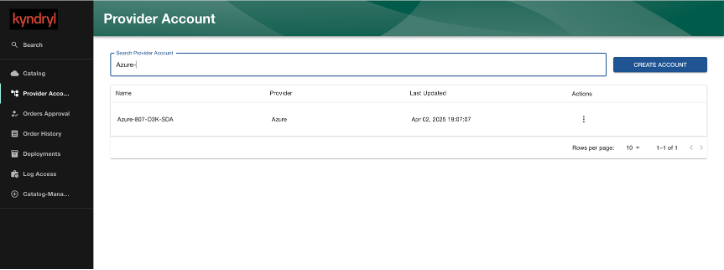
</figure>
<h4 id="create-account">Create Account</h4>

The create account option in the screen enables the user to onboard a
new provider account. The user sees the below screen when clicked on the
button “Create Account”. The user will have option to choose from a set
of available pre-configured Provider(s) as links for the user to choose
based on the account to be onboarded.

<figure>
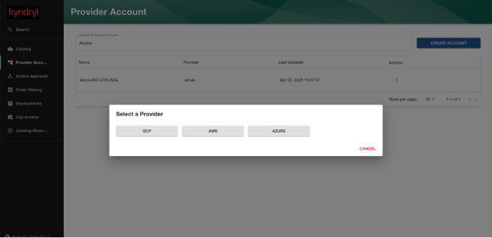
</figure>

Once the user selects one option from the screen, in our case (AWS)
from the list of links, the below screen is loaded with the details to
be entered by the user.

<figure>
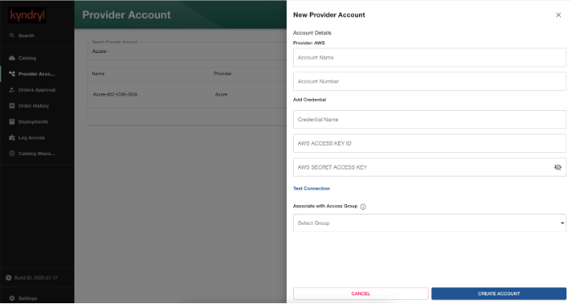
</figure>

<strong>New Provider Account fields details:</strong>

<ul>
<li>Account Name: The name of the account that the user prefers to be
using for the new provider onboarded.</li>
<li>Account Number: This is the AWS account number that the user needs
to enter in this field.</li>
<li>Credential Name: This fields is for AWS Credential name.</li>
<li>AWS Access Key ID: The ID that gets generated for the AWS account
which the user wants to onboard.</li>
<li>AWS Secret Access Key: The AWS Secret key needs to be entered in
this field by the user for which the user wants to onboard.</li>
</ul>

<strong>Associate with Access Group:</strong>

This field is a pre-populated dropdown type of field from which the
user can choose a Group to associate the provider account with the
access group. This enables the provider to fall under the same access
group.

<blockquote>

Note: all the fields in this page are mandatory and required to be
filled in by the user before creating the account.

</blockquote>

<strong>Test Connection:</strong>

This option is provided for the user to validate that all the data
entered by just clicking the link on this page. The system posts the
information entered and validates to the provider end. The connection
test result is displayed on the screen if it is successful or failure
after the live validation is completed by the system. 
This option ensures that when the user starts choosing the provider
during the actual provisioning, the user will not face any issues with
respect to the data provided in this screen.

Once the test connection shows a successful message. The user can
then click on the “Create Account” button to create this provider in the
HCSM system. This ensures that the provider can be utilized by the user
when requesting the resources.

<h3 id="user-access-management">User Access Management</h3>

User Access Management is a critical component of HCSM system,
ensuring that users can access only the resources and functionalities
appropriate to their roles. Which mainly enhances security, compliance,
and operational efficiency by controlling and monitoring user
interactions with the system. The User management is accessible to the
users with “System Administrator” role. Or if the user belongs to the
team which has the role “System Administrator” assigned to it.

<figure>
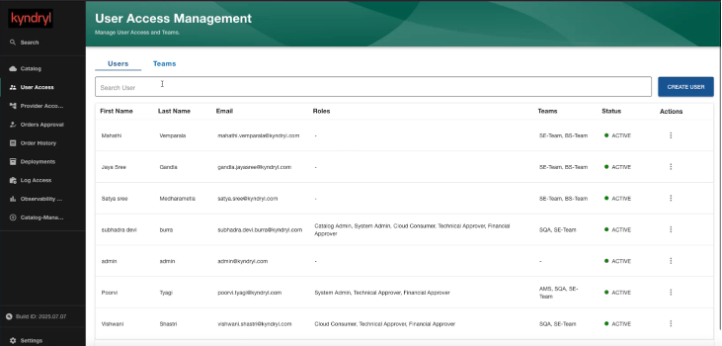
</figure>

When the user clicks on the “User Access Management” option from the
left side menu, the above screen gets displayed with all the current
users onboarded in the system. The page has multiple columns like First
name, Last name, Email, Roles assigned to that user, The team(s) the
user belong to, and the status of the user (Active/Inactive).

<h4 id="options-in-the-page">Options in the page</h4>
<h5 id="search-user">Search user</h5>

The below screen shows the option with which the user can search for
a particular user by his/her name. As the user types in the letters, the
system searches against the name and filters the data to display as
displayed in the below screen.

<figure>
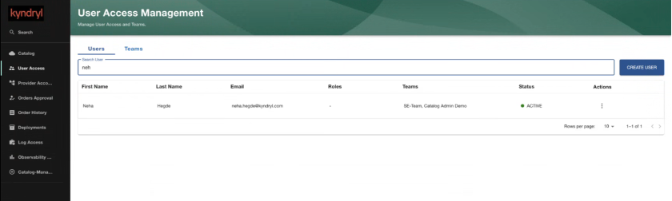
</figure>
<h5 id="create-user">Create user</h5>

The user can select “Create User” option by clicking the button on
the top right corner of the page. The screen opens a popup window with
options to enter the details about the user as shown below. This screen
consist of fields to be entered by the user like First Name, Last Name,
Email ID and allow the user to associate role by choosing the options in
the “Assign Roles” dropdown.

<figure>
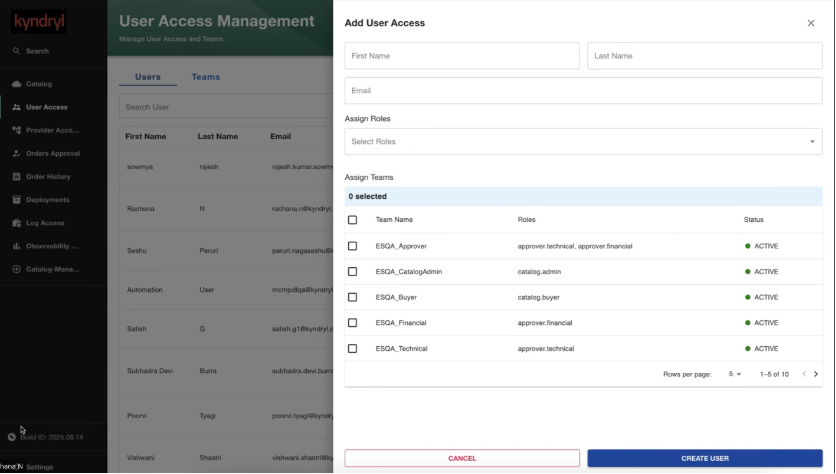
</figure>

The users can be directly assigned with roles or associate with the
Teams which are already created and available within the next field
“Assign Teams”. This option helps the user to get associated with one or
more teams available under this section as shown in the screenshot
below.

Assign roles from drop down Assign Roles:

<figure>
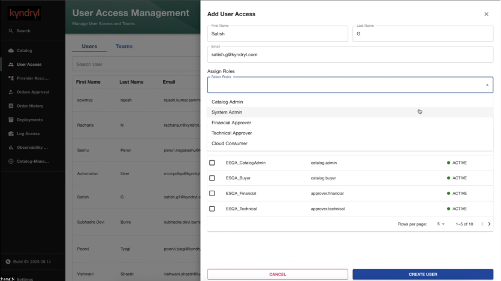
</figure>

Assign users to Teams from the drop down “Assign Teams”:

<figure>
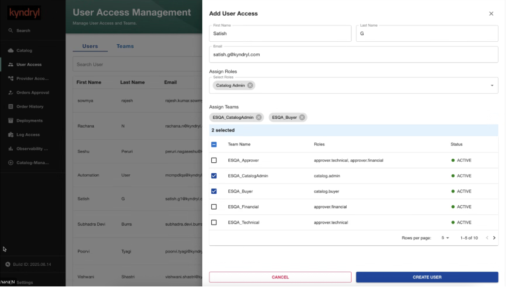
</figure>

Once the user enters the data for the user and associates the user to
Roles and/or Teams and clicks on Create User button, the screen displays
a small popup window on the top right corner to confirm that the user is
created successfully as shown in the below screen.

<figure>
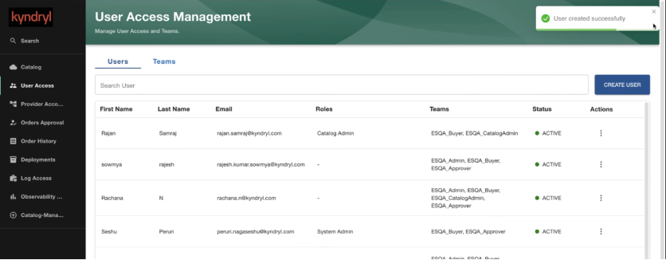
</figure>

The below screen shows how the newly added user looks like with the
“Active” state as shown below highlighted in blue. The users added newly
will be active by default when it is saved within the system. If
required these users can be made inactive which is covered below
sections.

<figure>
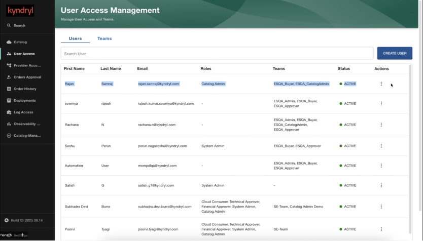
</figure>
<h5 id="edit-user">Edit User</h5>

The user has an option to make changes to the currently available
user details within the system. This option helps to keep the user data
updated with the fields that are allowed to be updated. We will see how
this can be achieved in more efficient way in this section. In the
screen below, the user can first use the “Search User” field to look for
a particular user data to be edited. The user can just start entering
the name and the system will dynamically search based on the keyed in
data to display the users line items in the below table section. Once
the user sees the required user, he/she can click on the 3 dotted button
against the line item. The user can click on the button and choose the
“Edit User” option as shown in the below screen.

<figure>
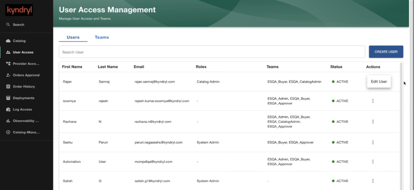
</figure>

Once the user clicks on the Edit User option, the user will see the
below screen with the current values for each previously entered field
values. The user has option to modify them except for few which are
grayed out to ensure that the user will not modify those using this
feature in the system. One of them is the “Email” field, where you can
see below it is disabled so that the user does not make the changes to
it. This is intentional. The HCSM system does not allow to modify the
email id.

The user can however update or modify the rest of the values like
Roles using the “Assign Roles” drop down, modify the teams that user
belong to using “Assign Teams” drop down and choosing the checkboxes as
shown below.

This makes it very flexible for the user to make these changes and
choose “Update User” button.

<figure>
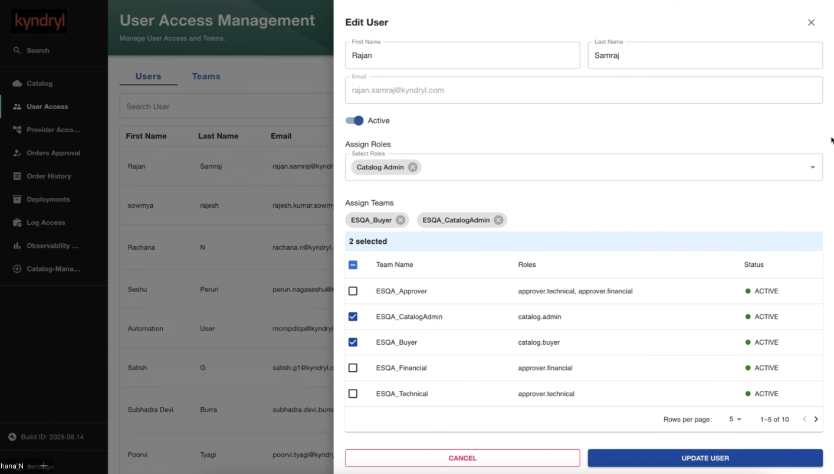
</figure>

After the user makes the changes and clicks on the button “Update
User”, the system submits the page with the updated values and saves to
the system accordingly. A small popup progress bar appears on the top
right corner of the screen to confirm that the screen was saved
successfully, and the user can navigate to other pages to see the
changes if required.

<figure>
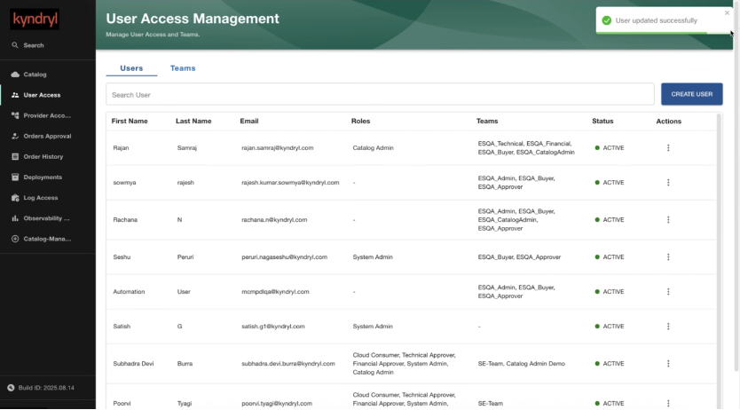
</figure>

This Users tab also has option to modify the number of rows to be
displayed in a single page by providing the option “Rows per page” drop
down right at the bottom of the screen as shown in the screen below. The
current options provided to the users are 10, 25 and 50. Along with the
pagination feature to navigate to the next set of rows if the line items
are more than the selected rows per page option.

<figure>
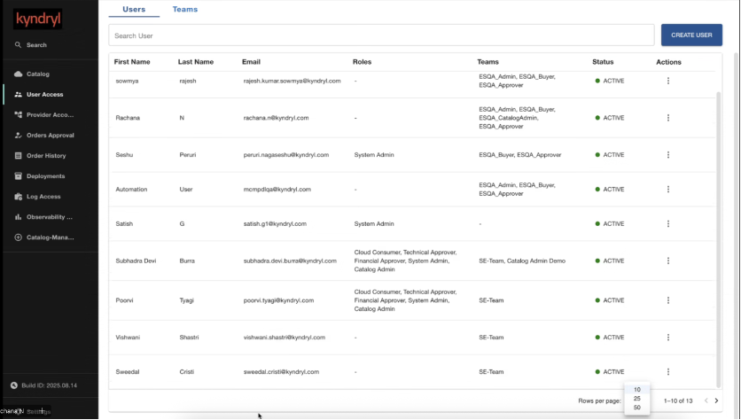
</figure>

This page also has option to sort and filter. Each column in this
page can be sorted based on the needs by the user. You can see an up
arrow shown in the screen below, this arrow represents the column
sorting order to be in ascending order, if the user clicks on the same
again, the column will be sorted in the descending order. It works like
a toggle button and makes it very flexible for the user to sort the
columns.

<figure>
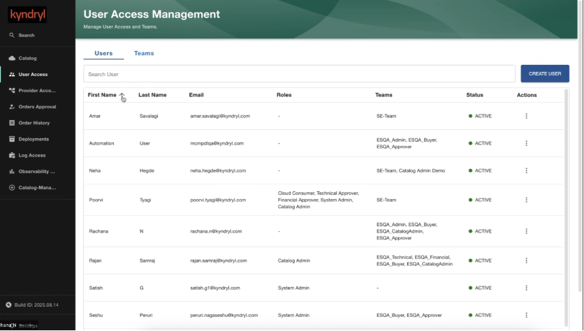
</figure>

The user can inactivate the user by selecting the below highlighted
toggle button “Inactivate” or activate the user by clicking on the same
button for the user who is already inactivated and selecting the “Update
User” button on the bottom section of this popup window. This will be
reflected in the main page “User Access” users tab immediately.

<figure>
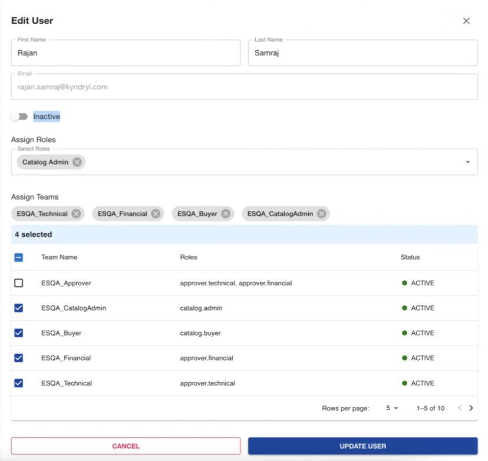
</figure>

<em>Please note: Currently there is not option to delete the user
through UI option for the user. Deleting the users is done through API
only.</em>

<h3 id="teams">Teams</h3>

Teams tab provides options to the user just like the “Users” tab.
When the user selects the “Teams” tab, the screen displays all the
existing teams that are previously configured by the user as shown in
the below screen. The user also has options to search for a particular
team, add or modify teams.

<figure>
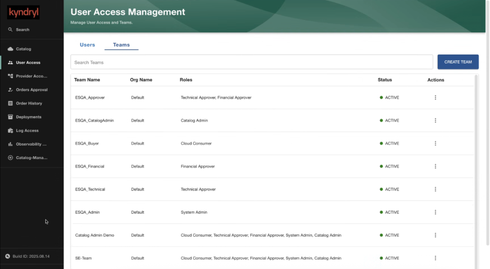
</figure>
<h4 id="options-in-the-page-1">Options in the page</h4>
<h5 id="search-teams">Search Teams</h5>

The below screen shows the option with which the user can search for
a particular team by the name. As the user types in the letters, the
system searches against the team’s name and filters the data to display
as displayed in the below screen.

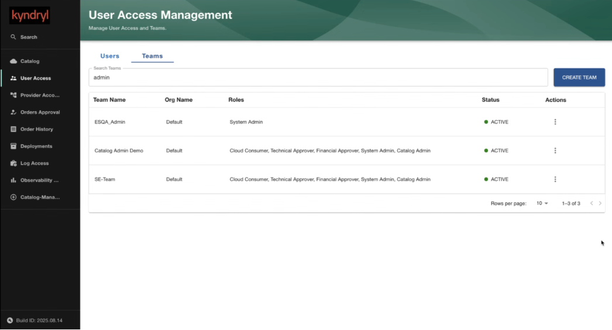

<h5 id="create-team">Create Team</h5>

The user can select “Create Team” option by clicking the button on
the top right corner of the page. The screen opens a popup window with
options to enter the details about the user as shown below. This screen
consists of fields to be entered by the user like Team name,
Description, allow the user to associate role by choosing the options in
the “Assign Roles” dropdown. The user can select the “Create Team”
button once all the data entered is validated and sure of creating the
team.

<figure>
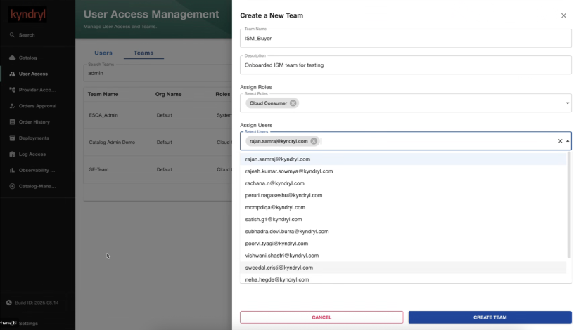
</figure>

Once the user enters the data for the user and associates the user to
Roles and/or Teams and clicks on “Create Team” button, the screen
displays a small popup window on the top right corner to confirm that
the Team is created successfully as shown in the below screen.

<figure>
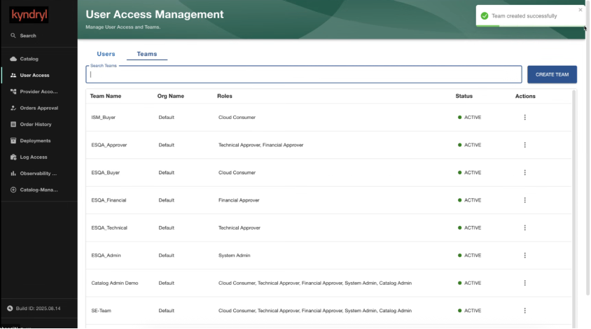
</figure>

Below screen shows the new team “ISM_Buyer” which got created/added
successfully within the HCSM system. The team can be now associated with
the users under the Users page. The status is Active by default. Any
change required for the Team needs to be done using Edit option covered
below sections.

<figure>
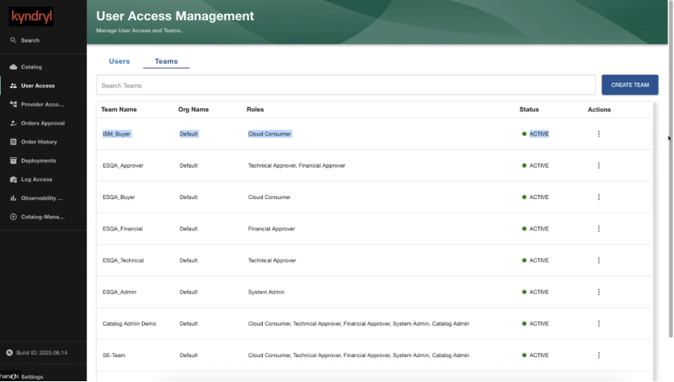
</figure>
<h5 id="edit-teams">Edit Teams</h5>

The user has an option to make changes to the currently available
Team details within the system. This option helps to keep the Team data
updated with the fields that are allowed to be updated. We will see how
this can be achieved in more efficient way in this section. In the
screen below, the user can first use the “Search Team” field to search
for a particular Team to be edited. As the user starts entering the
team, the system will dynamically search based on the keyed in letters
and words to display the teams in the below table section.

Once the user sees the required team, he/she can click on the 3
dotted button against the line item. The user can click on the button
and choose the “Edit Team” option as shown in the below screen.

Once the user clicks on the Edit Team option, the user will see the
below screen with the current values for each previously entered field
values. The user has option to modify them except for few which are
grayed out to ensure that the user will not modify those using this
feature in the system. In this case it is “Team Name” field, where you
can see below it is disabled so that the user does not make the changes
to it. This is intentional. The HCSM system does not allow to modify the
Team Name. In case the user wants to rename the Team name, current team
needs to be deleted or inactivated and then the user can create a new
team for the required purpose.

The user can however update or modify the rest of the values like
Roles using the “Assign Roles” drop down, modify the Users using the
“Assign Teams” drop down. The user can inactivate or activate the
existing team by using the toggle button “Active/Inactive” as
required.

This makes it very flexible for the user to make these changes and
choose “Update Team” button.

<figure>
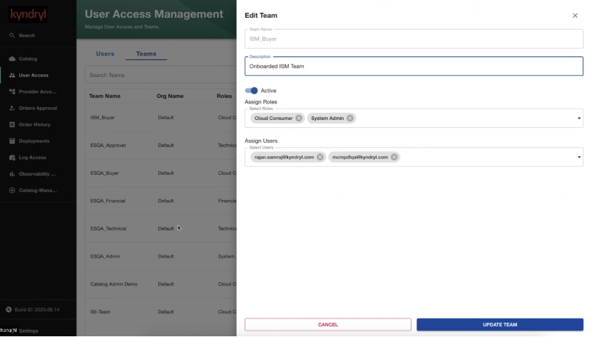
</figure>

Once the user enters the data for editing the teams and associates
Roles and/or Users and clicks on “Create Team” button, the screen
displays a small popup window on the top right corner to confirm that
the Team is updated successfully as shown in the below screen.

<figure>
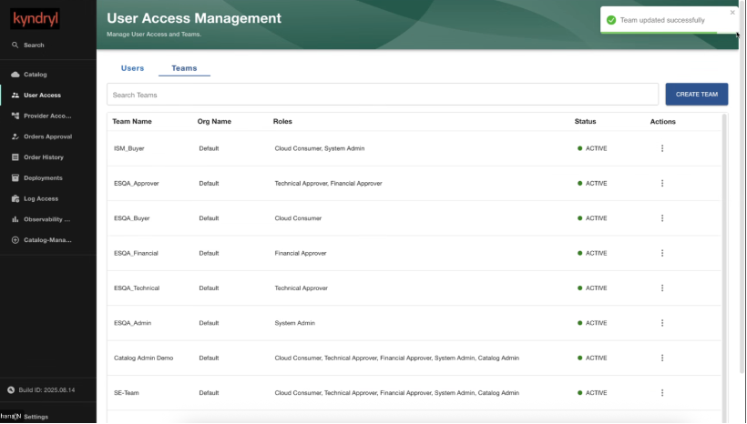
</figure>

The user can inactivate the Team just like the inactivating the Users
by selecting the below highlighted toggle button “Inactivate” or
activate the user by clicking on the same button for the Team which is
already inactivated and selecting the “Update Team” button on the bottom
section of this popup window. This will be reflected in the main page
“User Access” Teams tab immediately.

<figure>
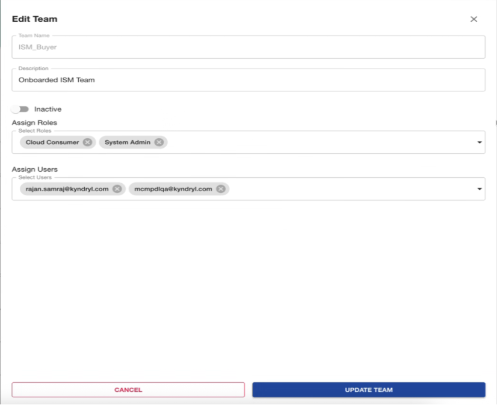
</figure>

The below screen shows the inactivated Team highlighted in blue
colour. The team can be modified to be active as required by the user
anytime.

<figure>
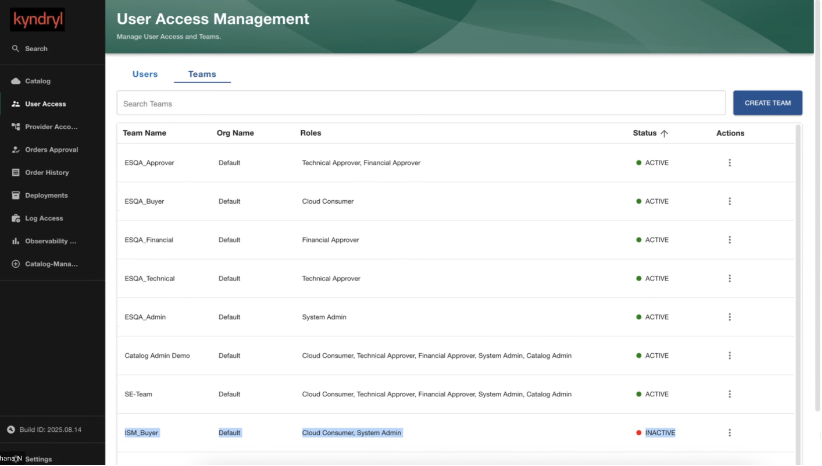
</figure>

<h3 id="service-catalogs">Service Catalogs</h3>
<figure>
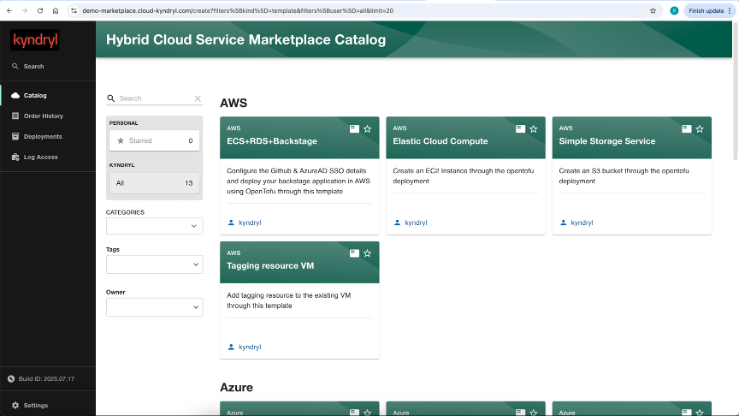
</figure>

The above screen is displayed for the respective user who
successfully login to the application. This screen acts as a marketplace
where required catalogs are curated and onboarded on this platform.
These catalogs are picked up from the Git Repository.

<h4
id="filteringsearching-options-within-the-catalogs-page">Filtering/Searching
options within the catalogs page</h4>

<strong>Options to filter the catalogs:</strong>

<ul>
<li>Personal</li>
</ul>

Starred option to make it favorite as below. It displays only the
ones that are marked as star.

<figure>

</figure>
<ul>
<li>Kyndryl All</li>
</ul>

This option displays all the catalogs that gets onboarded to the
application in this page as shown below.

<figure>
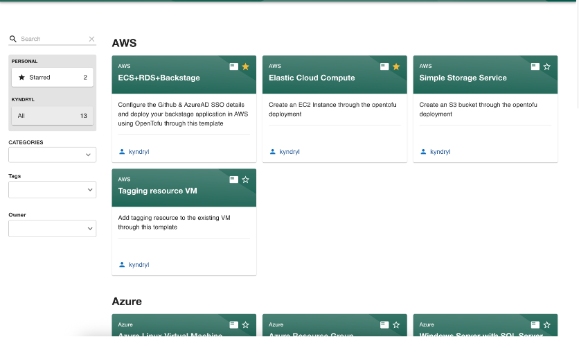
</figure>
<ul>
<li>Categories</li>
</ul>

This option displays only the catalogs that falls under a specific
provider-based category. In this case only Azure catalogs will be
displayed on the screen as below.

<figure>
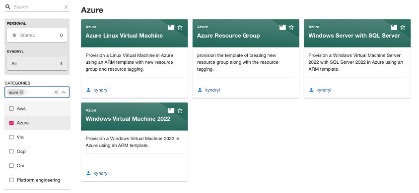
</figure>
<ul>
<li>Tags</li>
</ul>

Tags provides another flexible way to sort the catalogs based on the
tags. The below screen shows all the Terraform templates to be
displayed.

<figure>
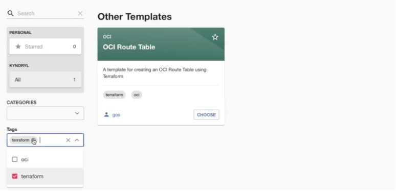
</figure>
<ul>
<li>Owner</li>
</ul>

Owner option provides search/filter based on the users who owns the
catalogs. Say for example, there will be some catalog visibility that
needs to be displayed only for Kyndryl employees, they can be made
visible based on the dropdown selection as below.

<figure>
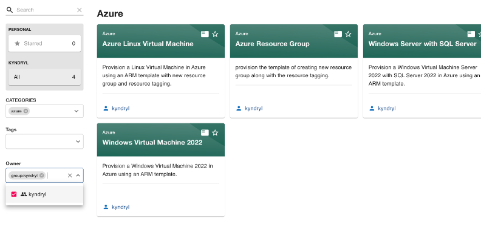
</figure>

<h3 id="day-one-provisioning">Day one provisioning</h3>

Day one operations typically involve a series of foundational steps
to ensure the resource is securely configured and ready to use by the
buyer using the HCSM system. The below steps will help the user to
achieve these steps.

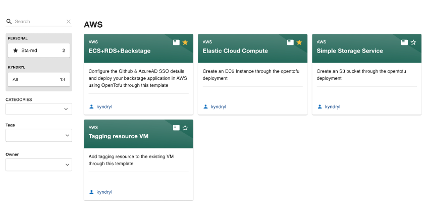

The above Catalogs screen displays the list of catalogs from the
system where the user can choose from the verities of catalogs based on
which provider(s) was configured when the system was setup by the
customer. In the current screen you can see AWS EC2 catalog is picked up
to show the provisioning flow.

<figure>
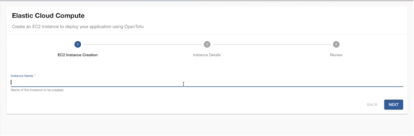
</figure>

The above screen displays the options for the user to input the
required parameters as per the respective template selected by the
user.

<figure>
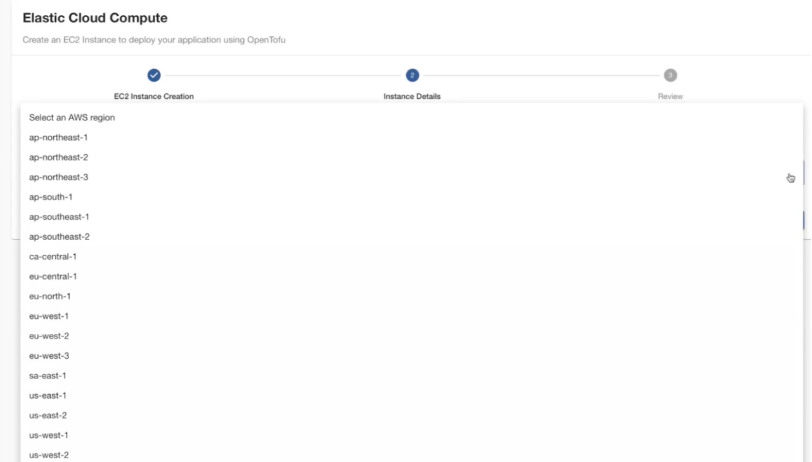
</figure>

The user gets to choose the regions that are displayed as dropdown.
In this configuration, the application fetches the available regions for
the subscription the user is currently using. This is dynamically
fetched from the APIs.

<figure>
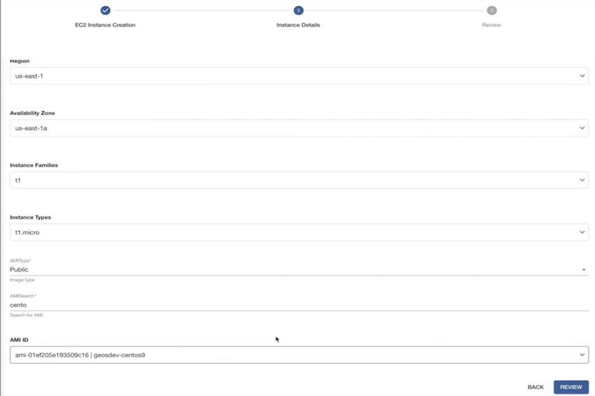
</figure>

The user can enter rest of the parameters as shown in the screen
above as an example (Instance Families, Instance Types, AMI Type AMI
details and choose Review button to see what values were provided by the
user.

<figure>
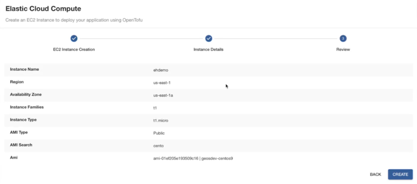
</figure>

Once the user selects Review option, the above page is displayed
where the user can verify the selections and entries done in the
previous tabs. Here the user can choose Create option to place the
order.

<figure>
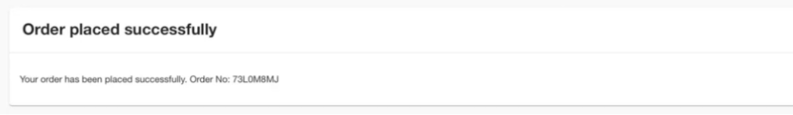
</figure>

On successful order placement, the above window is displayed. The
flow for Day One order placement in the application ends with this
successful message on a happy day scenario.

<h3 id="day-two-provisioning">Day two provisioning</h3>

Day two operations for the provisioned resources focus on
pre-provisioning activities that ensure the resource is in full control
to be managed using the HCSM system to support basic operations like
(Start/Stop/Restart and Delete). The user can perform actions based on
the required actions needed.

Every Day two feature creates a new tracking order within the HCSM
system. This order will follow the day two lifecycle workflow till it
gets successfully completed like day one.

The Day two actions supported by the system are as below:

<ol type="1">
<li>Start</li>
<li>Stop</li>
<li>Restart</li>
<li>Delete (Decommission)</li>
</ol>
<h4 id="start">Start</h4>

The order which gets completed successfully through HCSM, it gets
listed as part of the “Deployments” page as shown below. These line
items are displayed with options to perform Day two on them. When the
user expands one line item, the data gets pulled for that order from the
provider end dynamically so that the user can perform actions on them.
Start option can be used by the user to start the resource (Virtual
machine) when it is required to be started as per the requirement. As
shown below, the user selects the start option, and a confirmation popup
is displayed for the user.

User clicks on Start option from the dropdown menu:

<figure>

</figure>

User selects confirm from the popup window:

<figure>

</figure>

Once the user confirms by clicking on the “Confirm” option, the
screen shows a process message as displayed in the screen below at the
top right corner. 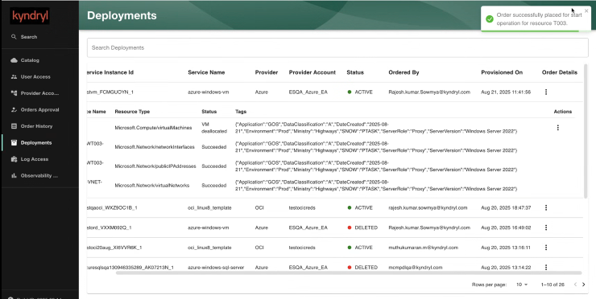

This action creates a new tracking order with the Order type as
“Operations” to show that it is a day two operation and keep it
different from other orders. The order status shows “Provisioning in
progress” status till the workflow gets completed as shown in the screen
below.

<figure>
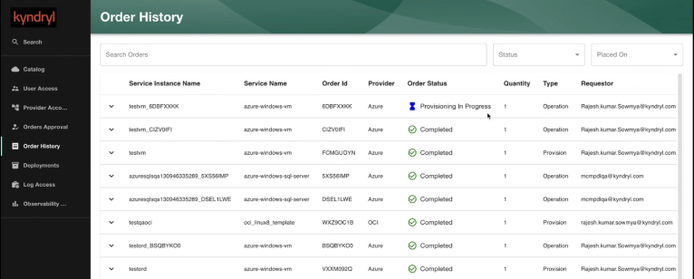
</figure>

Once the order with the type “Operations” gets created an email to
the respective approver will be sent as per the RBAC setup so that the
approver can login to the system and approve from the screen below. When
the user chooses the menu “Order Approval” from the left side menu bar,
the order to be approved gets displayed with options like “Approve” or
“Deny” as shown in the screen below.

<figure>
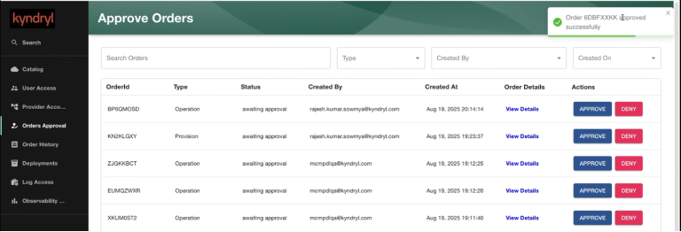
<figcaption aria-hidden="true">Day2 approval</figcaption>
</figure>

Once the user clicks on the “Approve” button, the popup window
appears with two options “Technical Review and Financial Approval”
respectively with the check box options as shown in the screen below.
Based on the type of approver/reviewer the user can choose one of the or
both together and click on “Approve” button. The technical reviewer will
only be choosing the one check box and click on approve button if he/she
is satisfied with the order with respect to technical perspective.

If the user is only a technical approver/reviewer, the user can just
choose the respective check box and click on the Approve button. The
Order will still be in pending stage because it will be fully approved
only after the financial approver completes the approval.

<figure>
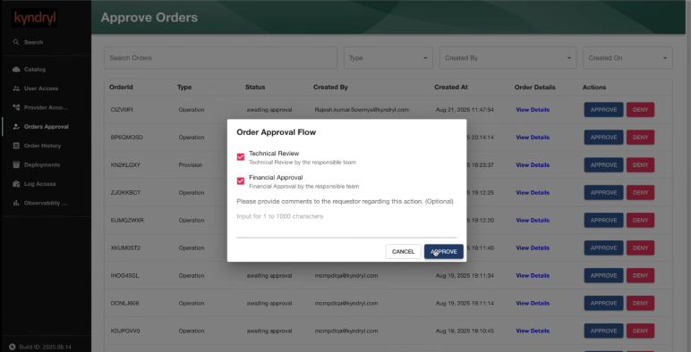
<figcaption aria-hidden="true">Day2 approval flow</figcaption>
</figure>

Once both the approvals are completed by the respective approvers,
the resource status changes to the next state based on the type of
action requested. In this case it shows VM running as shown in the below
screenshot.

<figure>
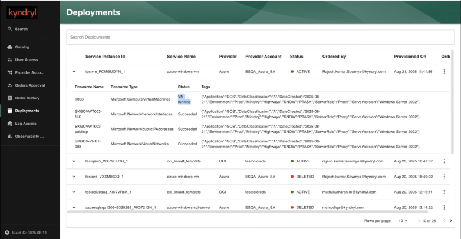
<figcaption aria-hidden="true">Day2 resources</figcaption>
</figure>
<h4 id="stop">Stop</h4>

When order which gets completed successfully through HCSM, it gets
listed as part of the “Deployments” page as shown below. These line
items are displayed with options to perform Day two on them. When the
user expands one line item, the data gets pulled for that order from the
provider end dynamically so that the user can perform actions on them.
The Stop option can be used by the user to stop the resource (Virtual
machine) which is currently in the running state.

User clicks on Stop option from the dropdown menu:

<figure>
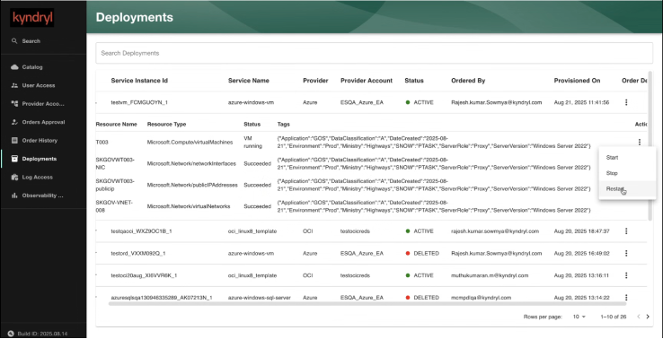
<figcaption aria-hidden="true">Day2 stop</figcaption>
</figure>

As shown below, the user selects the stop option, and a confirmation
popup is displayed for the user. User selects confirm from the popup
window:

<figure>
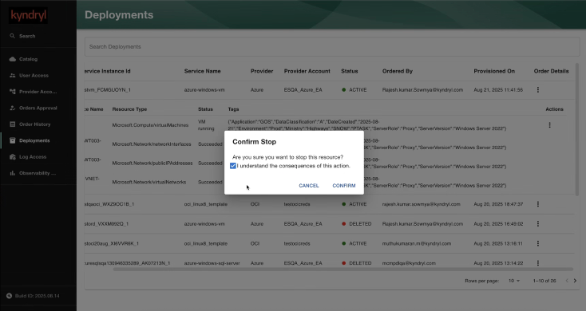
<figcaption aria-hidden="true">Day2 stop confirm</figcaption>
</figure>

The system creates an order for approval. In approval page there will
be a line item with the “Type” as Operation and the status as “awaiting
approval” as shown below. The purpose of this order getting created is
mainly for tracking the approval workflow withing HCSM. The order is
then expected to follow similar workflow as a normal order with
notifications and approvals.

<figure>
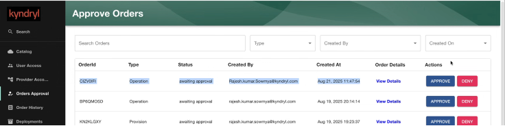
<figcaption aria-hidden="true">Day2 stop workflow</figcaption>
</figure>

The user has an option to see these orders details to understand what
the order was created for and to get more information on the order by
clicking on the order details feature available by clicking on the 3
dots button towards the right side of every line item within the Approve
Orders page:

<figure>
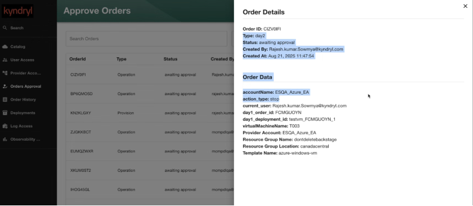
<figcaption aria-hidden="true">Day2 stop details</figcaption>
</figure>

Based on the RBAC, the respective user gets the notification to
approve or deny the Order based on the findings and needs. When the user
chooses approve button, the options like Technical and Financial gets
displayed as below. Based on the type of user, the user can choose the
approval option and click on the approve button.

<figure>

<figcaption aria-hidden="true">Day2 stop approval</figcaption>
</figure>

The system submits the option chosen by the approver and shows a
small popup window on top right corner of the screen with successful
approval message for the order as shown below: 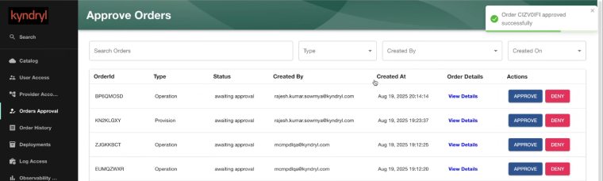

This action creates a new tracking order with the Order type as
“Operations” to show that it is a day two operation and keep it
different from other orders. The user can click on Order History page to
get more information on the operation. The order status shows
“Provisioning in progress” status till the workflow gets completed as
shown in the screen below. 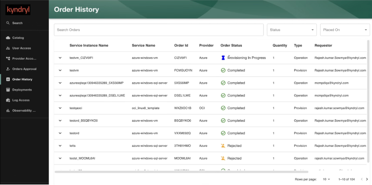

Once the resource is stopped(In our case the virtual machine), the
status of the VM shows stopped as below within the Deployments page.
This ensures that the user has successfully stopped the VM which was
running state as shown below.

<figure>
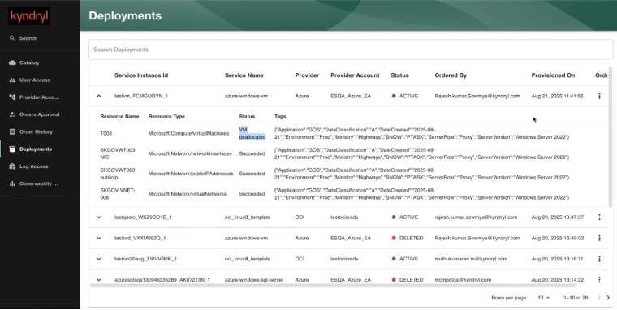
</figure>
<h4 id="restart">Restart</h4>

When the order gets completed successfully through HCSM, it gets
listed as part of the “Deployments” page as shown below. These line
items are displayed with options to perform Day two on them. When the
user expands one line item, the data gets pulled for that order from the
provider end dynamically so that the user can perform actions on them.
The user can now click on the button with 3 dots at the end of every
item for options.

Restart option can be used by the user to restart the resource
(Virtual machine) when it is required to be restarted as per the
requirement. The user can choose restart option only for a resource
which is in running state.

<figure>
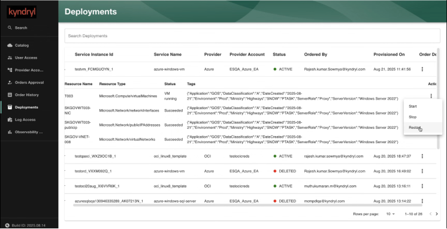
<figcaption aria-hidden="true">Day2 restart</figcaption>
</figure>

After the user selects restart option, a confirmation popup will be
displayed for the user to confirm the action as shown below in the
screen.

<figure>
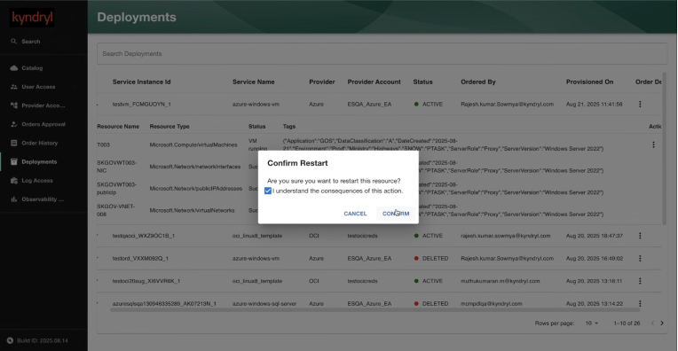
</figure>

The system then displays a small progress popup window on the top
right corner to display the operation just created by the user as shown
below.

<figure>
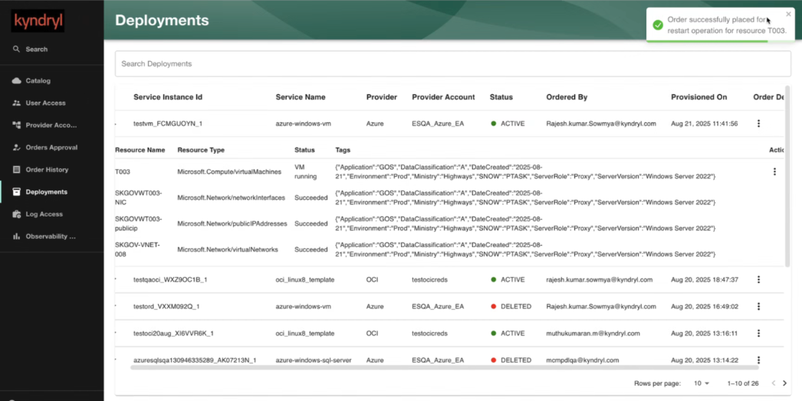
</figure>

When the user goes to the Order History page, the system displays an
order created for tracking purpose for the restart workflow. The order
status will be “pending approval” as shown below. The order is then
expected to follow similar workflow as a normal order with notifications
and approvals.

<figure>
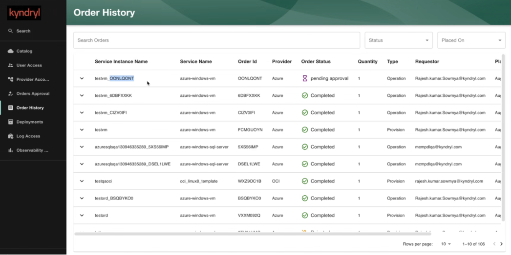
</figure>

The workflow creates a line item within the approval page with the
“Type” as Operation and the status as “awaiting approval” as shown
below. The purpose of order getting created is mainly for tracking the
approval workflow withing HCSM.

<figure>
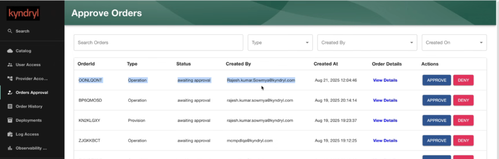
</figure>

Based on the RBAC, the respective user gets the notification to
approve or deny the Order. When the user chooses approve button from the
Approve Orders screen against the order related to restart option, the
options like Technical and Financial gets displayed as below. Based on
the type of user, the user can choose the approval option and click on
the approve button.

<figure>
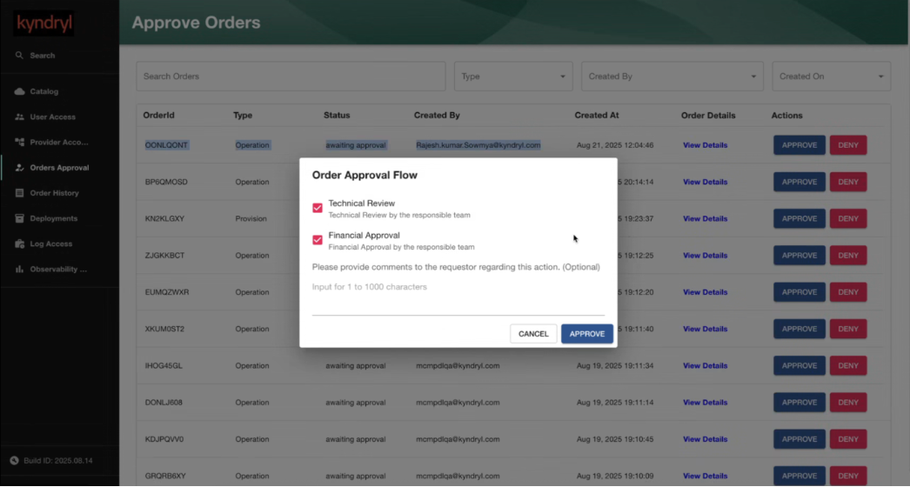
</figure>

Once the user clicks the approve button, a small popup progress
window displays on the top right corner as shown below. This helps the
user to understand that the process was successfully done, and the user
can now navigate to other pages.

<figure>
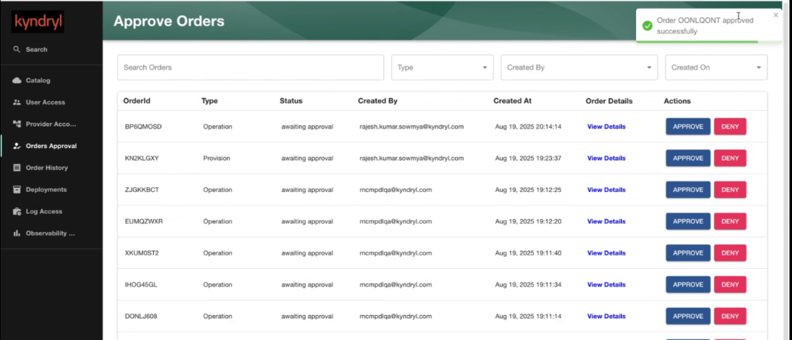
</figure>

Once it is successfully restarted, the status shows as VM Running as
shown below. This helps the user to understand that the vm is
successfully restarted.

<figure>
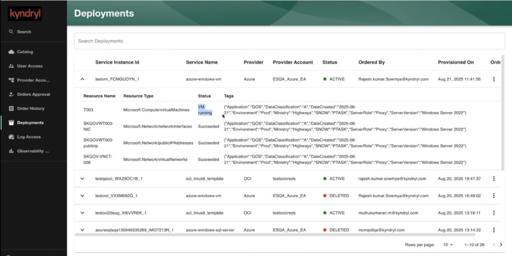
</figure>
<h4 id="delete">Delete</h4>

When the order gets completed successfully through HCSM, it gets
listed as part of the “Deployments” page as shown below. These line
items are displayed with options to perform Day two on them.

When the user expands one line item, the data gets pulled for that
order from the provider end dynamically so that the user can perform
actions on them.

Delete option can be used by the user to decommission the resource
based on the requirement. This delete option can be don only at the
order level and not at the underlaying component level as shown in the
below screen. The user can click on the 3 dots option button and select
delete from the drop down.

<figure>
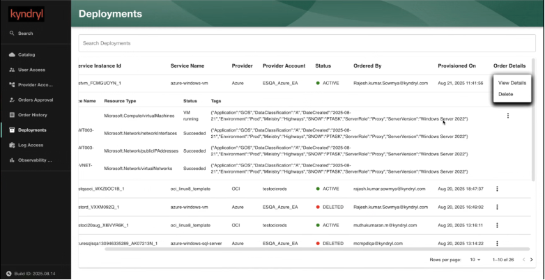
</figure>

The user is displayed with a confirmation popup window to make sure
if it can be deleted or decommissioned with a warning message as
displayed below. The alert is mainly to ensure that the user is aware of
the consequences of the action. The consequence is that the order may
have underlaying components which will get deleted automatically when
the user deletes the order. The resources from the provider end gets
released and terminated, however the delete of order in the HCSM is a
soft delete and it will be marked as “Deleted”.

<figure>
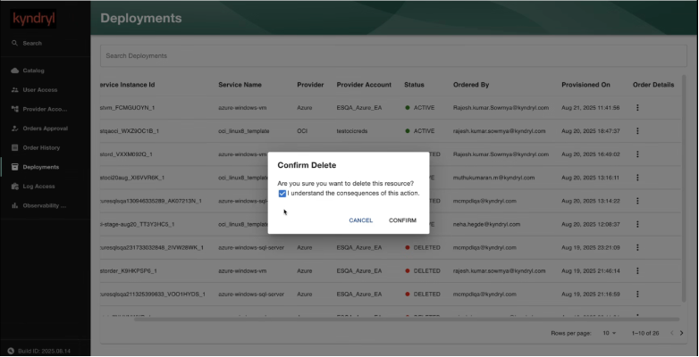
</figure>

Once the user clicks the approve button, a small popup progress
window displays on the top right corner as shown below. This also
displays the resource name which is going to get decommissioned or
deleted for the user to ensure it is the right one after the
confirmation.

<figure>

</figure>

When the user goes to the Order History page, the system displays an
order created for tracking purpose for the delete workflow. The order
status will be “pending approval” as shown below. The order is then
expected to follow similar workflow as a normal order with notifications
and approvals.

<figure>
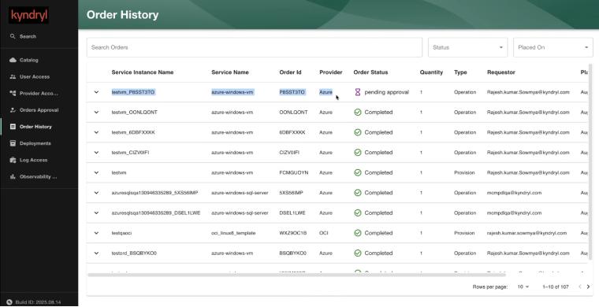
</figure>

The workflow creates a line item within the approval page with the
“Type” as Operation and the status as “awaiting approval” as shown
below. The purpose of order getting created is mainly for tracking the
approval workflow withing HCSM.

<figure>
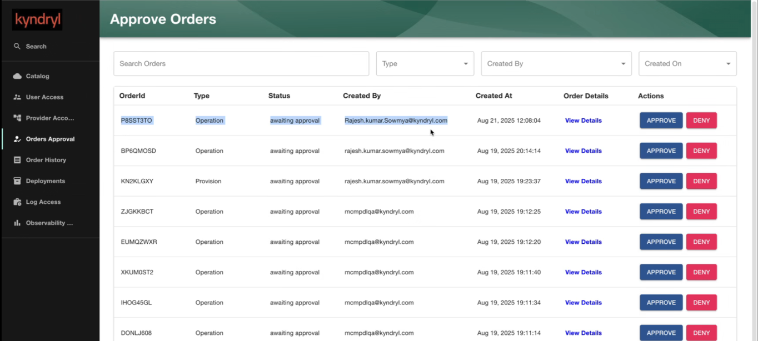
</figure>

The user has option to see the details on the order that is currently
getting decommissioned or deleted as shown in the below screen along
with other details on the resource that is getting deleted.

<figure>
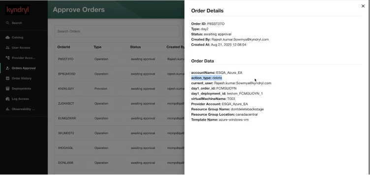
</figure>

Based on the RBAC, the respective user gets the notification to
approve or deny the Order to be deleted or decommissioned. The user can
then login to the application by clicking on the link provided in the
email to take further action like approvals.

The user can then choose the approve orders option from the menu and
look for the order that is available for approval related to delete
order.

When the user chooses approve button from the Approve Orders screen
against the order related to restart option, the options like Technical
and Financial gets displayed as below. Based on the type of user, the
user can choose the approval option and click on the approve button.

<figure>
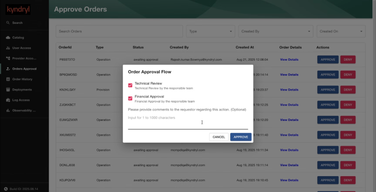
</figure>

Once the user clicks the approve button, a small popup progress
window displays on the top right corner as shown below to show that it
is successfully approved. This help the user to understand that the
process was successfully completed, and the user can navigate to other
screens to view.

<figure>
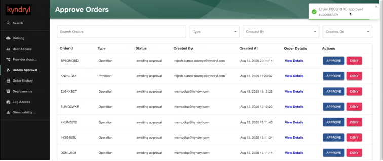
</figure>

Once the order is successfully executed and resource is deleted in
the provider end, the HCSM system now shows the below status when the
user opens the “Deployments” page.

<figure>
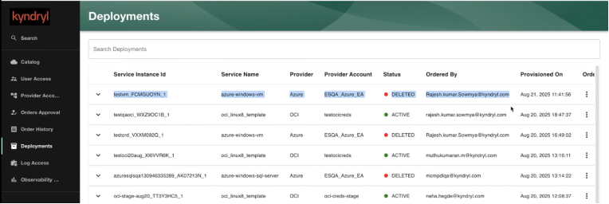
</figure>

Finally, the user can also view the Order details along with the tags
and order data as below to understand what order got deleted by clicking
on the option “View Details” option against the deleted order.

<figure>
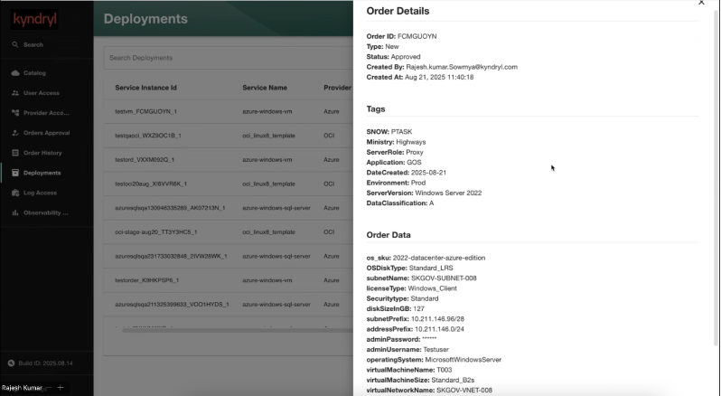
</figure>

<h3 id="genericorder-lifecycle-and-management">GenericOrder Lifecycle
and Management</h3>
<ul>
<li>Order Approval Flow</li>
<li>Order Status and other detailed lifecycle</li>
<li>Re-Try Order flow and management</li>
<li>Decommissioning the Order (Decom workflow)</li>
</ul>
<h4 id="order-approval-flow">Order Approval Flow</h4>

System has two levels of approvals (Manual and Auto) based on the
deployment and the customer’s request.

<strong>Manual approval:</strong>

<ul>
<li>When the user (Buyer) places a new order, a notification email is
sent to the respective set of approvers (Configured based on the RBAC)
to approve the order</li>
<li>The approver receives and email notification which contains a URL
for the user to click. This link takes the approver to the application
to approve the order as shown in the screen below.</li>
<li>The approver will have to click on the “Order Approval” link from
the menu shown in the screen below.</li>
</ul>
<figure>
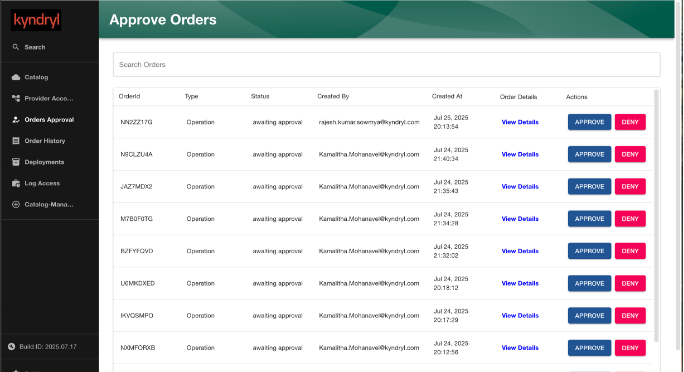
</figure>

<strong>Types of approvals available:</strong>

<ul>
<li>Technical: The technical approval is mainly focused to see if the
order requested have any challenges technically that the approver can
validate.</li>
<li>Financial: The financial approval is mainly focused on the cost of
the requirement. The approver will validate to see if the request is
within the approved financial limits.</li>
</ul>
<figure>
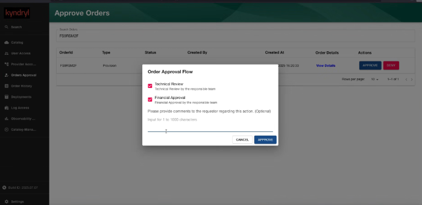
</figure>

<strong>Auto Approval:</strong>

<ul>
<li>When the user (Buyer) places a new order, If the approval is set to
Auto mode, the approval is not required and there is no waiting time for
the approvals.</li>
<li>A notification by email is however sent to the user who placed the
order with the status.</li>
</ul>

<h4 id="order-status-and-lifecycle">Order Status and Lifecycle</h4>

<strong>Order status:</strong>

<ul>
<li>Pending Approval</li>
<li>Provisioning in progress</li>
<li>Completed</li>
<li>Partially Completed</li>
<li>Failed</li>
<li>Rejected</li>
</ul>

<strong>Status flow details:</strong>

<ul>
<li>The Order goes into multiple stages during the lifecycle of the
Order Processing/Provisioning.</li>
<li>When a user places new order, it initially go to ”Pending Approval”
state. The system sends an email notification to the approvers as per
the RBAC.</li>
<li>Once the respective approvers complete the approval process
(Technical and Financial), the status of the Order change to
“Provisioning In Progress”.</li>
<li>Once the provisioning is complete at the provider end, the Order
goes to the final state either “Completed” or “Failed” based on the
provisioning results.</li>
<li>The application user also has an option to Reject the Order if
he/she feels the order placed is not required anymore before the
provisioning completes.</li>
</ul>

<h3 id="order-history">Order History</h3>
<figure>
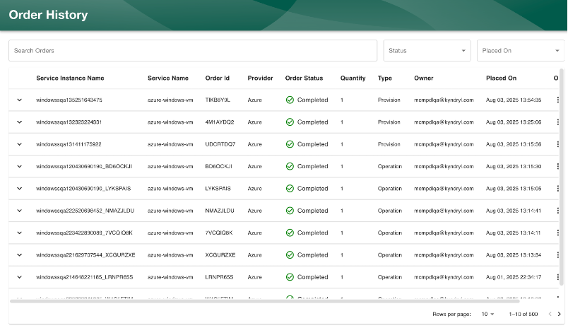
</figure>

The Order History page displays all the orders placed through the
HCSM system along with its specific Order Status and other details as
shown in the above screen. This screen comes with multiple important
details like Service Instance Name, Service Name, Order status, Type,
Owner and the dates.

This screen also has important feature to filter, or search based on
the Order number, Status of the order (Completed/Failed/Rejected) and
based on the duration period when the orders were placed as shown below
sections.

<h4 id="search-options">Search Options</h4>
<ul>
<li>Status: This option helps the user to find the orders based on the
Status of the Order as displayed in the below screenshot. The current
options are: All, Completed, Failed, Rejected, Pending Approval and
Provisioning in Progress. The user can choose one of them and see all
the orders that belong to that status and which the user will have the
access to view.</li>
</ul>
<figure>
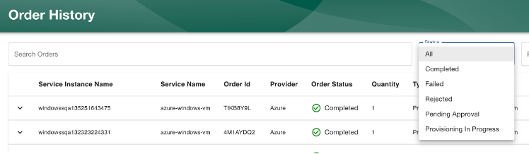
</figure>
<ul>
<li>Placed On: This option helps the user to find the orders based on
the date the Orders were placed. For the users convenience, the options
provided for this as are All, Today, Last 7 days, Last 3 Months and Last
6 Months as displayed in the below screenshot. The user can choose one
of them and see all the orders that belong to that period of time and
which the user will have the access to view them based on the RBAC.</li>
</ul>
<figure>
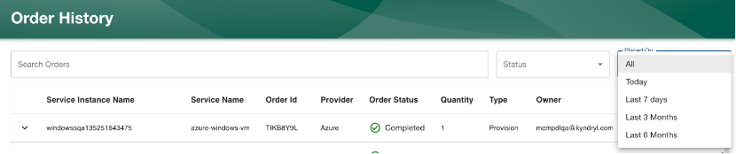
</figure>

Order History provides other options like View Details, View Failure
reasons and orders Retry against specific order for the users.

<ul>
<li>View Details/Failure: provides the details for the specific order
either they are in Completed or Failed.</li>
<li>Retry: This feature helps the user to perform the Retry on any
failed orders that were placed by the user who is logged in based on the
RBAC.</li>
</ul>
<figure>
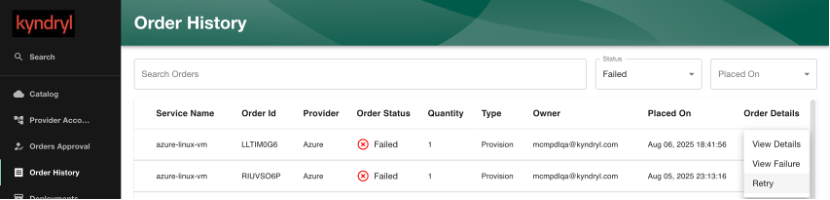
</figure>

The confirmation screen will be displayed to the user as shown
below:

<h2 id="hisory-retry">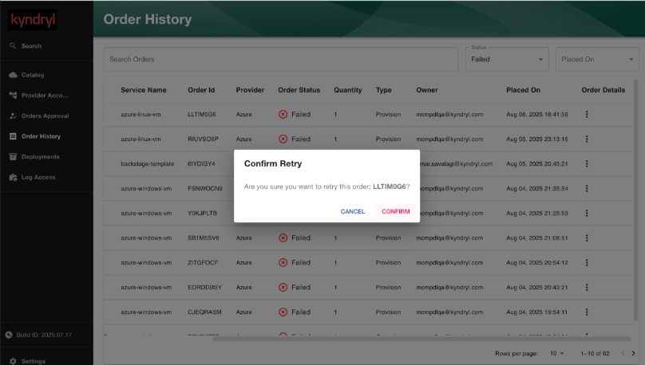</h2>
<h3 id="deployments">Deployments</h3>
<figure>
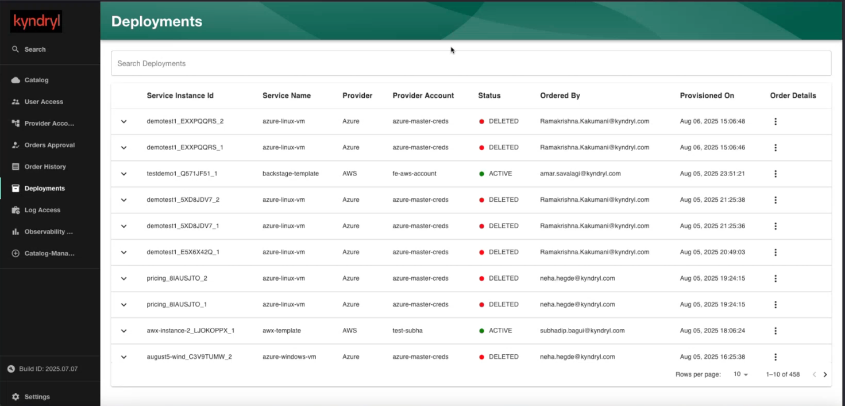
</figure>

The deployments page displays all the resources that are provisioned
through this system. The list of instances along with the service
details like Name, Provider, Current status etc. are displayed.

When the user tries to explode a deployment by clicking the system
dynamically pulls the related details from the respective provider to
display the line item under it with the related resources under them as
show in the screen below. The details like Resource Name, Resource Type,
Status and Tags are displayed with respect to the resources.

<figure>
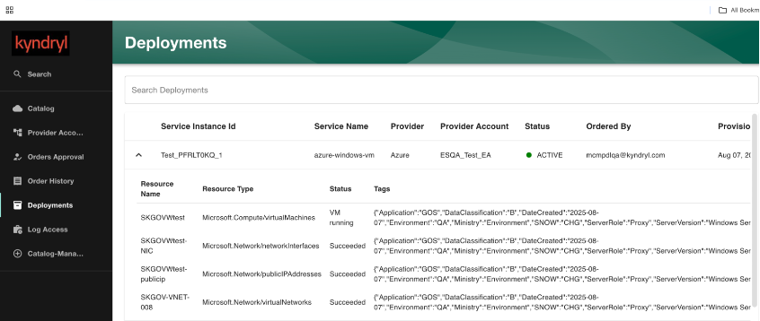
</figure>

View Details and Delete options are available for each resource
within the Deployments page for the user to see the Order details or to
delete them if required to delete them from the UI. These are soft
delete.

<figure>
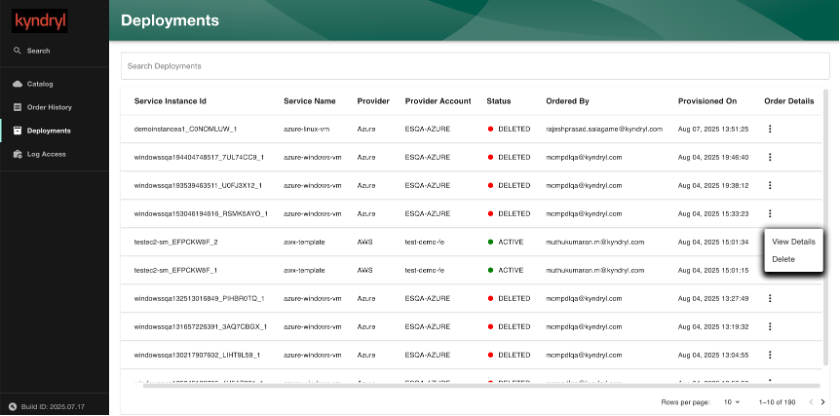
</figure>

When the user clicks on the “View Details” option, the below screen
is displayed with all the details with respect to that specific Order
Item.

<figure>
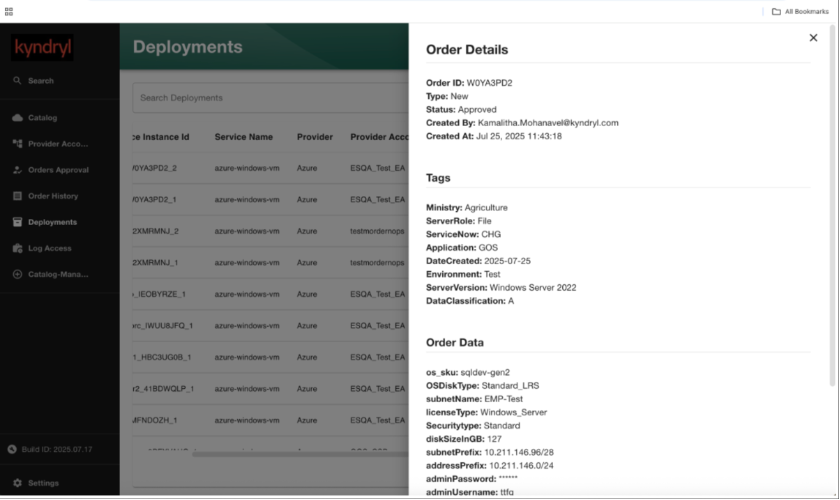
</figure>

Delete: When the user chooses to delete a line item from the
deployments, a confirmation window popsup as below to get the
confirmation if he/she really wants to delete the Order deployment with
an understanding that the related resources will be left disconnected
within the system.

<figure>
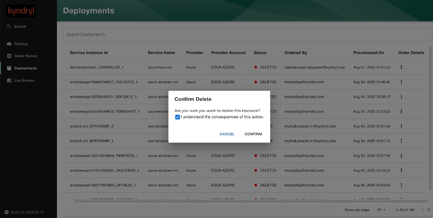
</figure>

When the user selects “Confirm”, the below screen is displayed to
show that the resource is being decommissioned. This might take few mins
based on the provider end.

<figure>
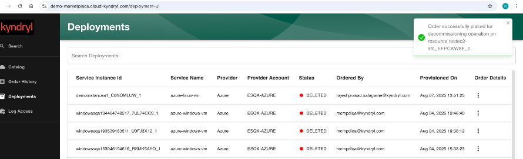
</figure>

The user can also manage the resources to provide day two operations
from this screen. This is explained in detailed in the “Day Two
provisioning” section in this document.

<strong>Deployment Status:</strong>

<ul>
<li>Active: The instances that are active and running at the provider
end are displayed as active instance.</li>
<li>Deleted: These deployments are deleted (Decommissioned) by the user.
The status of this will be terminated at the provider end.</li>
</ul>

<h3 id="log-access">Log Access</h3>
<figure>
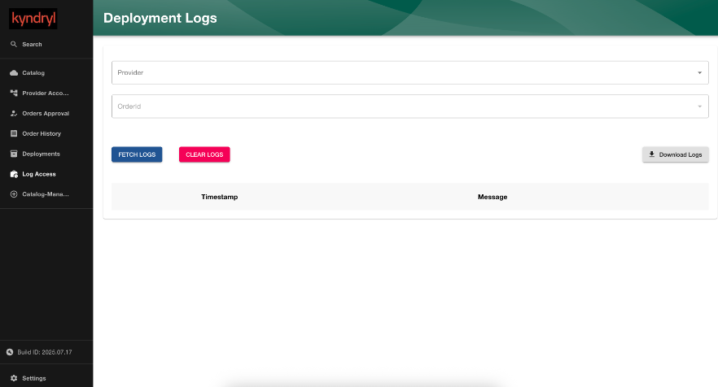
</figure>

The deployments logs are displayed in this page. This page is
accessible to the user based on RBAC. This log is the application log
from the system. The intent of this option for the user is to view the
results along with the data during provisioning in case of order
provisioning success or failure with the reasons.

The user will have option to choose which logs to fetch based on the
provider selection from the dropdown.

For example, in the below screen the user can choose the provider
along with a specific Order ID and click on the button “Fetch Logs” to
see the data (Timestamp and the actual message) in the table format to
get more details.

<figure>
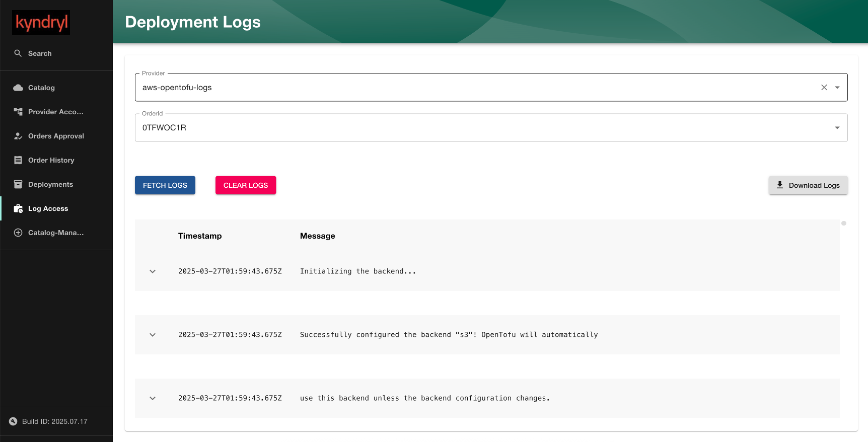
</figure>

<h3 id="rbac">RBAC</h3>

This section talks about the Role Based Access Control within the
application and how they are designed to help the users manage or use
the HCSM application.

The HCSM application user should be able to manage users and their
roles either when the client AD doesn’t support group/roles or when the
client wants to manage users directly on the HCSM application. The
design in the link provided below discusses how this structure should be
created and used.

When a user logs in to the system using client IDP (used only for
authentication purpose), determine the user’s roles mapped in the
system.

Authorize the user to perform specific activities based on the roles
he has been assigned to in the system.

<table style="width:99%;" data-border="1" data-cellpadding="0"
data-cellspacing="0">
<colgroup>
<col style="width: 10%" />
<col style="width: 89%" />
</colgroup>
<thead>
<tr data-bgcolor="#f4f5f2">
<th>Role</th>
<th>Use cases</th>
</tr>
</thead>
<tbody>
<tr>
<td>Catalog Consumer</td>
<td>1. Able to view Catalog page &amp; submit order 
2. Able to view Order history page. 
3. Able to view Deployments page &amp; Perform D2 
4. Able to access Logs page 
5. Able to view observability page - raised ticket</td>
</tr>
<tr>
<td>Technical Approver</td>
<td>1. Able to access Catalog page, but choose option is not
available 
2. Able to access Order approval page, able to approve / deny
order 
3. Able to access order history page 
4. Able to access deployments page - able to perform d2ops, delete 
5. Able to access Logs page 
6. Able to view observability page - raised ticket</td>
</tr>
<tr>
<td>Financial Approver</td>
<td>1. Able to access Catalog page, but choose option is not
available 
2. Able to access Order approval page, able to approve / deny
order 
3. Able to access order history page 
4. Able to access deployments page - able to perform d2ops, delete 
5. Able to access Logs page 
6. Able to view observability page - raised ticket</td>
</tr>
<tr>
<td>System Admin</td>
<td>1. Able to access catalog page, but choose option is not
available. 
2. Able to access provider account page, able to create/edit/delete an
account. 
3. Able to access User access management, create/update - user,
create/delete/update - team 
4. Able to access Order history page 
5. Able to access deployments page - able to perform d2ops, delete 
6. Able to access logs page 
7. Able to view observability page - raised ticket</td>
</tr>
<tr>
<td>Catalog Admin (Not in scope for QA)</td>
<td>1. Able to access catalog page, but choose option is not available
&amp; we have register existing component 
2. Able to access order history page 
3. Able to access deployments page - able to perform d2ops, delete 
4. Able to access logs page 
5. Able to view catalog management page &amp; perform actions 
6. Able to view observability page - raised</td>
</tr>
</tbody>
</table>
</figure>